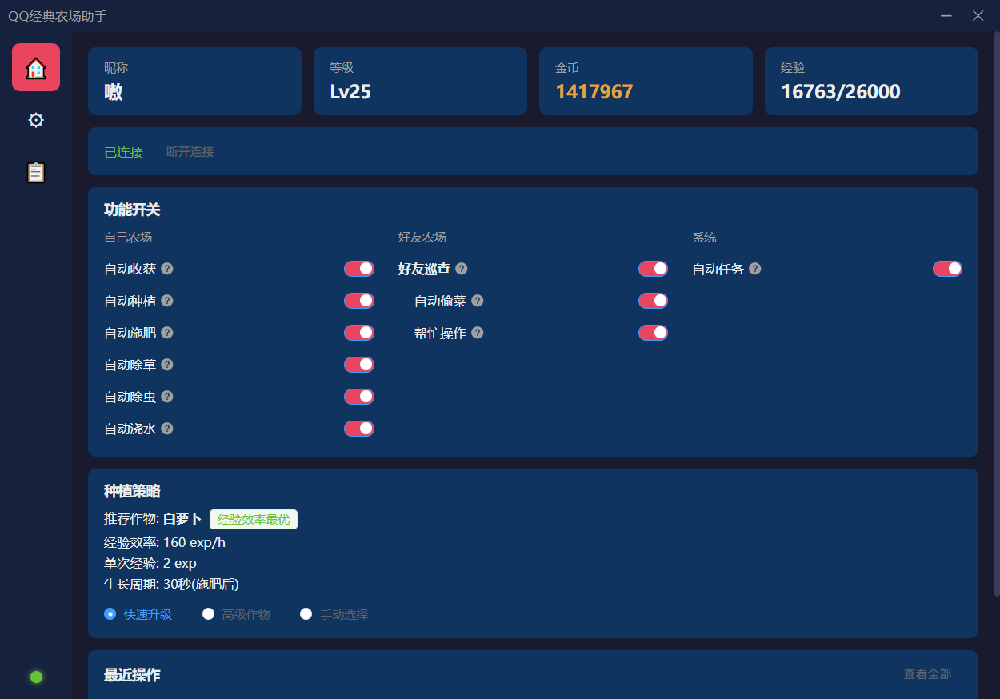
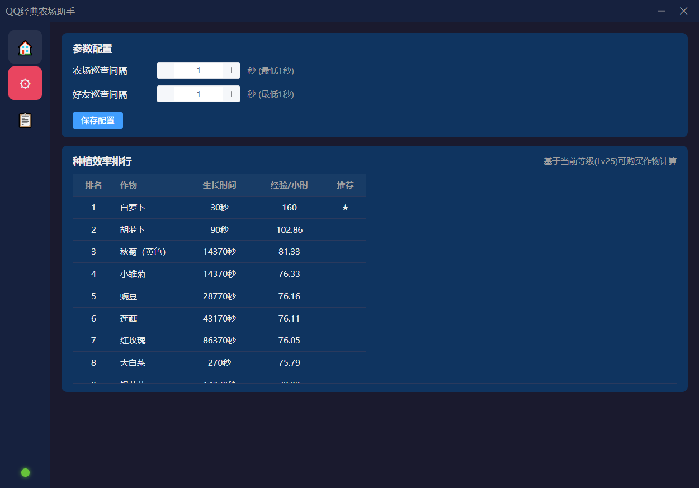
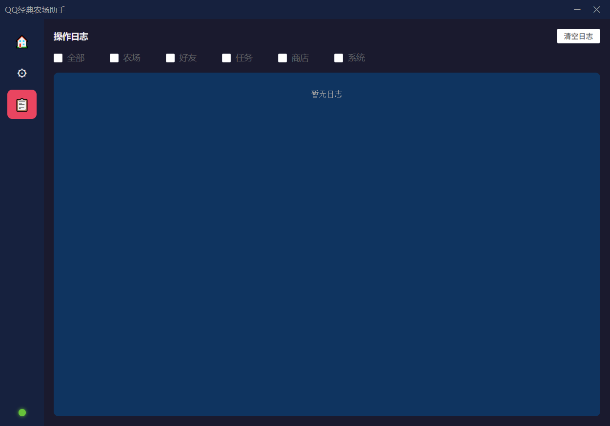

<div align="center">

# QQ经典农场助手

[](LICENSE)
[](https://nodejs.org/)
[](https://www.electronjs.org/)
[](https://vuejs.org/)
[](https://www.typescriptlang.org/)

**基于 Electron + Vue 3 的 QQ/微信经典农场小程序自动化桌面应用**

通过分析小程序 WebSocket 通信协议（Protocol Buffers），实现全自动农场管理

支持智能种植策略 · 好友互动 · 任务系统 · 实时日志

[功能特性](#功能特性) · [快速开始](#安装) · [使用文档](#使用方式) · [技术栈](#技术栈)

</div>

---

> **💡 项目说明**
> 本项目基于 [linguo2625469/qq-farm-bot](https://github.com/linguo2625469/qq-farm-bot) 进行重构和功能增强，从 CLI 脚本升级为 Electron 桌面应用，新增 Vue 3 可视化界面、多种植策略、实时状态更新等功能。

## 📸 应用截图

<table>
<tr>
<td width="50%">

<p align="center"><b>首页 - 功能开关与种植策略</b></p>
<p align="center">实时显示农场状态、经验金币，支持独立功能开关和三种种植策略</p>
</td>
<td width="50%">

<p align="center"><b>设置页 - 参数配置</b></p>
<p align="center">自定义巡查间隔、平台选择，查看所有可种植作物效率排行</p>
</td>
</tr>
<tr>
<td colspan="2">

<p align="center"><b>日志页 - 实时操作记录</b></p>
<p align="center">查看所有自动化操作日志，支持按类型筛选和实时滚动</p>
</td>
</tr>
</table>

## ✨ 功能特性

<table>
<tr>
<td width="50%">

### 🌱 自己农场
- ✅ **自动收获** — 检测成熟作物并自动收获
- ✅ **自动铲除** — 自动铲除枯死/收获后的作物残留
- ✅ **智能种植** — 三种策略可选
  - 🚀 快速升级（经验效率最优）
  - 🌟 高级作物（单次经验最高）
  - 🎯 手动选择（自定义种植）
- ✅ **自动施肥** — 种植后自动施放普通肥料加速生长
- ✅ **自动除草** — 检测并清除杂草
- ✅ **自动除虫** — 检测并消灭害虫
- ✅ **自动浇水** — 检测缺水作物并浇水

</td>
<td width="50%">

### 👥 好友农场
- ✅ **好友巡查** — 自动巡查好友农场（主开关）
- ✅ **帮忙操作** — 帮好友浇水/除草/除虫（有经验上限）
- ✅ **自动偷菜** — 偷取好友成熟作物（有经验）

### ⚙️ 系统功能
- ✅ **自动任务** — 自动领取完成的任务奖励
- ✅ **自动同意好友** — 微信同玩好友申请自动同意
- ✅ **邀请码处理** — 启动时自动处理邀请链接
- ✅ **实时状态更新** — 经验/金币/等级实时显示
- ✅ **心跳保活** — 自动维持 WebSocket 连接

</td>
</tr>
</table>

### 🎨 桌面应用特性

- 🖥️ **现代化界面** — Vue 3 + Element Plus 暗色主题
- 🎛️ **功能开关** — 每个功能可独立开启/关闭，带详细说明
- 📊 **实时日志** — 查看所有操作记录，支持筛选
- ⚡ **配置持久化** — 自动保存配置，下次启动自动应用
- 🔔 **系统托盘** — 最小化到托盘，后台运行不打扰
- 🔄 **双平台支持** — QQ 和微信小程序均可使用

## 📦 安装

### 环境要求

- Node.js >= 16.0.0
- npm 或 pnpm

### 克隆仓库

```bash
git clone https://github.com/QianChenJun/qq-farm-bot.git
cd qq-farm-bot
npm install
```

## 🔑 获取登录 Code

本工具需要小程序的登录凭证（code）才能连接服务器。code 具有时效性，过期后需重新获取。

<details>
<summary><b>📱 抓包方式（Fiddler）</b></summary>

1. 手机安装 Fiddler 证书，配置代理指向电脑
2. 电脑打开 Fiddler，开启 HTTPS 解密
3. 手机打开 QQ/微信 → 进入「经典农场」小程序
4. 在 Fiddler 中筛选请求，找到 WebSocket 连接或登录请求中的 `code` 参数
5. 复制 code 值，粘贴到本工具中使用

> **💡 提示**：code 具有时效性，短时间内断开重连可复用同一 code，过期后需重新进入小程序获取。

</details>

## 🚀 使用方式

### 方式一：Electron 桌面应用（推荐）

```bash
# 开发模式
npm run electron:dev

# 打包为安装程序
npm run electron:build
```

打包后在 `release/` 目录生成 `QQ经典农场助手 Setup x.x.x.exe`，安装后即可使用。

**桌面应用提供：**
- 🎨 可视化操作界面（暗色主题）
- 🎛️ 功能开关实时切换（带详细说明）
- 🌱 种植策略配置（快速升级 / 高级作物 / 手动选择）
- ⏱️ 巡查间隔调整
- 📋 实时日志查看与筛选
- 🔔 最小化到系统托盘

### 方式二：CLI 命令行

```bash
# QQ 小程序登录
npm run cli -- --code <你的code>

# 微信小程序登录
npm run cli -- --code <你的code> --wx

# 自定义巡查间隔
npm run cli -- --code <你的code> --interval 30 --friend-interval 5
```

**参数说明：**

| 参数 | 说明 | 默认值 |
|------|------|--------|
| `--code` | 小程序登录凭证（必需） | - |
| `--wx` | 使用微信登录 | QQ |
| `--interval` | 自己农场巡查间隔（秒） | 1 |
| `--friend-interval` | 好友农场巡查间隔（秒） | 1 |

## 📁 项目结构

<details>
<summary><b>点击展开查看详细结构</b></summary>

```
qq-farm-bot/
├── electron/          # Electron 主进程模块
├── renderer/          # Vue 3 前端界面
├── src/               # 核心业务模块（CLI & Electron 共用）
├── proto/             # Protobuf 协议定义
├── gameConfig/        # 游戏配置数据
└── docs/              # 项目文档
```

</details>

## ⚙️ 配置说明

### Electron 桌面应用

配置通过界面操作，自动保存到用户数据目录（`%APPDATA%/qq-farm-bot/config.json`）：

- **平台选择**：QQ / 微信
- **种植模式**：
  - 🚀 快速升级（经验效率最优，适合快速升级）
  - 🌟 高级作物（单次经验最高，适合高等级玩家）
  - 🎯 手动选择（自定义种植作物）
- **巡查间隔**：自己农场 / 好友农场分别设置
- **功能开关**：每个自动化功能可独立开启/关闭，带详细说明

### CLI 命令行

通过启动参数配置，详见上方参数说明表。

### 邀请码（仅微信）

在项目根目录的 `share.txt` 中每行放一个邀请链接，启动时自动处理：

```
?uid=xxx&openid=xxx&share_source=xxx&doc_id=xxx
```

## ⚠️ 注意事项

- ⏱️ code 具有时效性，短时间内可复用，过期后需重新从小程序获取
- 🔐 同一账号同时只能在一个地方登录，启动本工具后小程序端会被踢下线
- 🌐 建议在稳定的网络环境下运行，断线后需重新获取 code 连接
- 📚 本项目仅供学习交流使用

## 🛠️ 技术栈

<table>
<tr>
<td align="center" width="20%">

<br />Node.js
</td>
<td align="center" width="20%">

<br />Electron
</td>
<td align="center" width="20%">

<br />Vue 3
</td>
<td align="center" width="20%">

<br />TypeScript
</td>
<td align="center" width="20%">

<br />Element Plus
</td>
</tr>
</table>

- **运行时**：Node.js >= 16.0.0
- **桌面框架**：Electron
- **前端框架**：Vue 3 (Composition API) + TypeScript
- **UI 组件库**：Element Plus (暗色主题)
- **构建工具**：Vite + electron-builder
- **通信协议**：WebSocket + Protocol Buffers

## 🤝 贡献

欢迎提交 Issue 和 Pull Request！

## 📄 License

[MIT](LICENSE)

## 🙏 致谢

本项目基于 [linguo2625469/qq-farm-bot](https://github.com/linguo2625469/qq-farm-bot) 进行重构和功能增强，感谢原作者的开源贡献。

---

<div align="center">

### 📊 Star History

[](https://star-history.com/#QianChenJun/qq-farm-bot&Date)

**如果觉得项目不错，请点个 ⭐️ Star 支持一下！**

</div>
